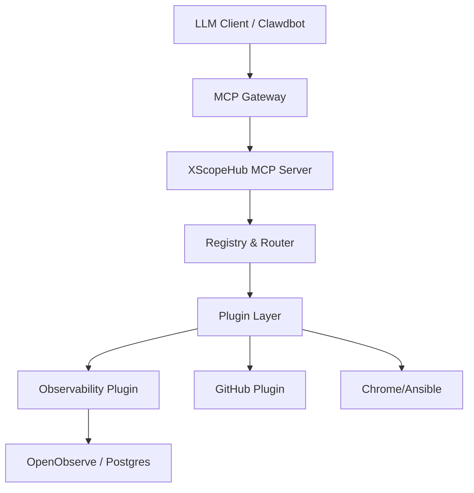

# XScopeHub MCP Server Design & Architecture

XScopeHub MCP Server is a centralized Model Context Protocol (MCP) Hub designed to orchestrate cloud infrastructure, deployment, observability, and LLM Agent automation.

## 1. MCP Protocol Specification

XScopeHub implements the MCP protocol using JSON-RPC 2.0 over HTTP/SSE.

### Message Format
- **JSON-RPC 2.0**: Standard request/response format.
- **Methods**:
    - `tools/list`: Enumerate available tools.
    - `tools/call`: Execute a specific tool with arguments.
    - `resources/list`: Enumerate available resources.
    - `resources/read`: Retrieve resource data.
    - `session/create`: Initialize a session context.

### Session Management
Sessions maintain state across multiple interactions, allowing agents to preserve context during complex workflows.

## 2. MCP Registry Design

The Registry is the central routing engine for all resources and tools.

- **Resource Registration**: Dynamic registration of data providers (Postgres, OpenObserve, etc.).
- **Tool Registration**: Tools are registered with JSON Schema validation for inputs.
- **Routing**: Requests are routed to the appropriate logic based on method and name.

## 3. Plugin System

XScopeHub uses a modular plugin architecture to extend capabilities.

### Plugin Interface
```go
type Plugin interface {
    ID() string
    Init(config map[string]interface{}) error
    Resources() []ResourceDescriptor
    Tools() []ToolDescriptor
    Execute(toolName string, args map[string]interface{}) (interface{}, error)
}
```

### Built-in Plugins
- **Monitor**: Connects to Prometheus/Grafana for observability data.
- **GitHub**: Automates PRs, issues, and repository management.
- **Chrome**: Provides browser automation for UI-based tasks.
- **Ansible/Terraform**: Orchestrates infrastructure and deployments.

## 4. Workflow Engine

A YAML-based engine for orchestrating multi-step automation.

- **Multi-step Execution**: Conditional execution based on previous step results.
- **Dependency Management**: Steps define `depends_on` relationships.
- **State Management**: Checkpointing allows for resumption after failures.
- **Rollback**: Automatic rollback mechanisms for failed deployment steps.

## 5. Architecture Diagram



## 6. Deployment Strategy

XScopeHub is designed for modern cloud environments.

- **Local Discovery**: Quick start scripts for local development.
- **Docker**: Containerized deployment using `docker-compose`.
- **Cloud Run**: Fully stateless implementation, ideal for serverless deployment on Google Cloud.
- **Kubernetes**: (Planned) Helm-based deployment for high availability.

## 7. Security & Observability

- **Authentication**: JWT-based authentication for secure access.
- **Policy Control**: Fine-grained allow/deny lists for tools and resources.
- **Metrics**: Prometheus metrics for monitoring server health and performance.
- **Audit Logging**: Comprehensive logs for all tool calls and workflow steps.

---
*Version: 1.1.0 | Updated: 2026-02-09*
